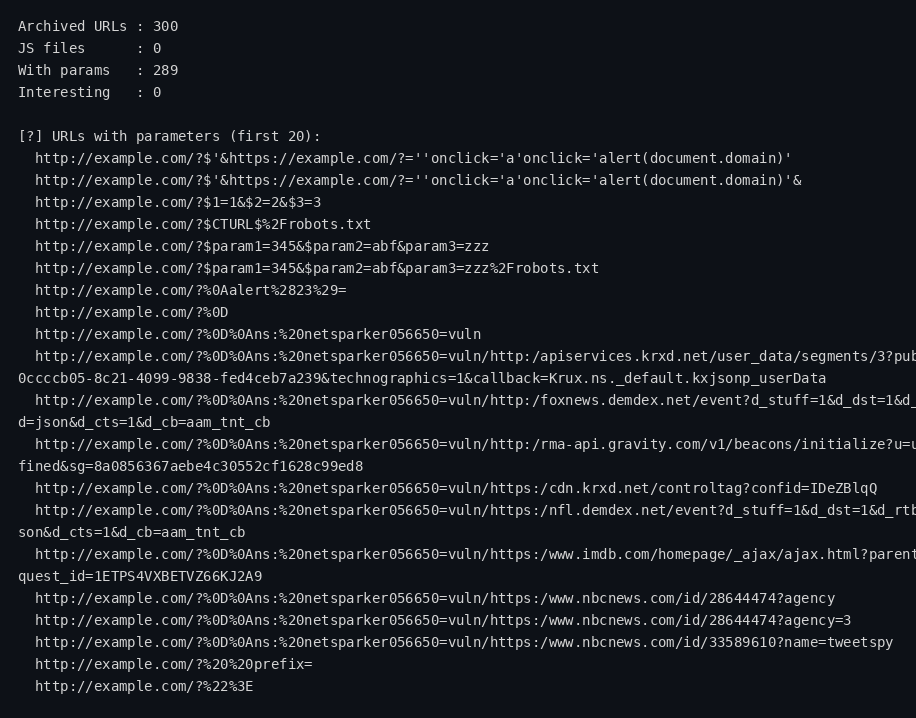

# WaybackMiner

Mine the [Wayback Machine](https://web.archive.org) for a domain's forgotten
attack surface. Passive recon — it only talks to `web.archive.org`, never
touches the target itself.

> **In simple words:** the internet keeps old copies of websites. WaybackMiner
> digs through those archived copies to find forgotten pages, links and clues —
> without ever visiting the site itself.

## What it finds

- **All archived URLs** for a domain (deduped, sorted)
- **JavaScript files** — prime recon targets
- **URLs with query parameters** — injection surface
- **Interesting files** — `.php`, `.bak`, `.sql`, `.env`, `.json`, `.git`, …

## Install

```bash
git clone https://github.com/harshzagade/WaybackMiner.git
cd WaybackMiner
```

Stdlib only. Python 3.8+.

## Usage

```bash
python3 waybackminer.py example.com
python3 waybackminer.py example.com --js-only
python3 waybackminer.py example.com --params-only
python3 waybackminer.py example.com --interesting-only
python3 waybackminer.py example.com --limit 5000 -o urls.txt
```

## Sample run

The sample below shows the exact output format (command and result), using
`target.example` as the placeholder domain. WaybackMiner is passive recon: it
only queries `web.archive.org` and never touches the target itself.

```console
$ python3 waybackminer.py target.example --limit 2000
Archived URLs : 137
JS files      : 6
With params   : 41
Interesting   : 3

[!] Interesting files:
  http://target.example/backup.sql
  http://target.example/config.json
  http://target.example/debug.log

[?] URLs with parameters (first 20):
  http://target.example/search?q=test
  http://target.example/product?id=128
  ...

[*] JS files (first 20):
  http://target.example/static/app.js
  http://target.example/static/vendor/analytics.js
  ...
```

With `--js-only`, the tool prints just the JS URL list (one per line) so you
can pipe it straight into other tools. With `--params-only`, it prints the
unique query-parameter names across the domain (sorted, one per line) — a
ready seed list for wordlist builders like ParamMiner. With
`--interesting-only`, it prints just the interesting-file URLs (`.bak`,
`.sql`, `.env`, …), one per line, for piping into downloaders or scanners.

```console
$ python3 waybackminer.py target.example --params-only
id
q
session
```

## Screenshots

Real run against `example.com` (a documentation-reserved domain — WaybackMiner
only queries `web.archive.org`, never the target itself):



## Tests

```bash
python3 -m unittest discover -s tests
```

## License

MIT
